# Zentro — Personal Financial Dashboard

**Next.js 14** app that aggregates multiple bank accounts via **Plaid**, shows balances and transactions, and enables payouts/transfers via **Dwolla**. Auth and data storage are powered by **Appwrite**. 
UI is built with **Tailwind + Radix UI**; forms use **React Hook Form + Zod**; charts use **Chart.js**.

---

## Features

* Link multiple banks via **Plaid Link** (react-plaid-link)
* Unified transactions list (Plaid + internal transfers), sorting by date
* Transfers between accounts via **Dwolla**
* **Appwrite** auth + user profile storage
* Responsive dashboard: total balance, recent transactions, charts
* Robust forms: **React Hook Form + Zod**
* Error visibility: **Sentry** for RSC, server actions, client

---

## Tech Stack

* **Framework:** Next.js 14 (App Router), React 18
* **UI:** Tailwind CSS, Radix UI, lucide-react, tailwindcss-animate, class-variance-authority
* **Forms:** react-hook-form, @hookform/resolvers, zod
* **Charts:** chart.js, react-chartjs-2
* **Integrations:** node-appwrite (server), plaid, react-plaid-link, dwolla-v2, @sentry/nextjs
* **Utils:** query-string, react-spinners

---

## Integrations (flow)

* **Appwrite:** registration → Appwrite user + user document; session cookie (httpOnly) stored as `appwrite-session` with **`session.$id`**; server client uses `.setSession(sessionId)`.
* **Plaid:** store `access_token` per bank; `getAccounts(userId)` builds bank list and balances; `getAccount(appwriteItemId)` merges Plaid transactions with internal transfers.
* **Dwolla:** create **Personal Customer** on sign-up; requires valid US address (e.g., `state` is a **2-letter code** like `CA`, `NY`).
* **Sentry:** error tracking across server/client.

---

## Environment Variables

Create `.env`:

```bash
# App URL
NEXT_PUBLIC_APP_URL=http://localhost:3000

# Appwrite (client, if needed)
NEXT_PUBLIC_APPWRITE_ENDPOINT=https://<your-appwrite>/v1
NEXT_PUBLIC_APPWRITE_PROJECT_ID=<project-id>

# Appwrite (server)
APPWRITE_ENDPOINT=https://<your-appwrite>/v1
APPWRITE_PROJECT_ID=<project-id>
APPWRITE_API_KEY=<server-key>

# Plaid
PLAID_CLIENT_ID=<client-id>
PLAID_SECRET=<secret>
PLAID_ENV=sandbox # sandbox | development | production

# Dwolla
DWOLLA_KEY=<key>
DWOLLA_SECRET=<secret>
DWOLLA_ENV=sandbox # sandbox | production

# Sentry (optional)
SENTRY_DSN=<dsn>
SENTRY_AUTH_TOKEN=<token>
```

---

<!-- Replace image paths with your repo paths (e.g., ./docs/screenshots/step1.png) -->

## How to Sign Up & Link a Bank (Sandbox)

> **Sandbox notes**
>
> - Bank OAuth test creds: **user_good / pass_good**.
> - Some steps can be skipped (just click the primary button).
> - Dwolla sign-up requires a valid US-style address. Use a **2-letter state** (e.g., `NY`), ZIP like `11101`, DOB `YYYY-MM-DD`, and SSN last 4 (e.g., `1234`).
> - **IMPORTANT:** now only US states are supported in sign-up form (e.g. NY)


#### 1) Create your Zentro account
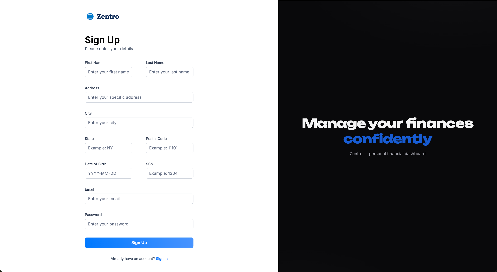

Fill First/Last name, Address, City, **State (2-letter, US only for example NY)**, Postal Code, DOB, SSN (last 4), Email, Password. Click **Sign Up** and wait.

### 2) Start linking a bank
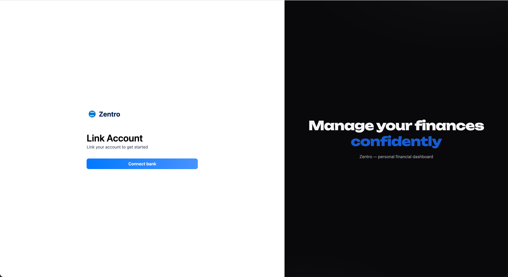

On **Link Account**, click **Connect bank** and wait.


### 3) Open Plaid Link & choose your institution
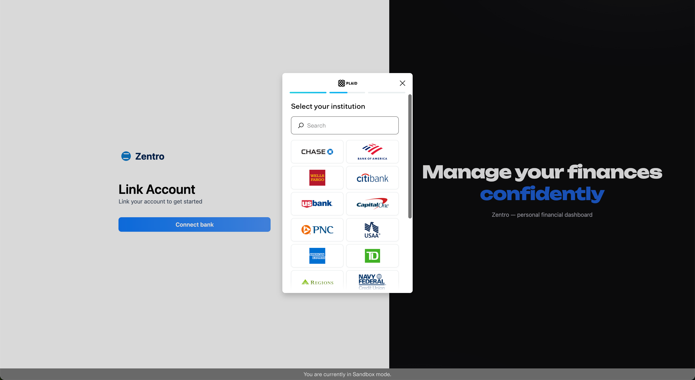

Select an institution (in Sandbox you can use **Chase** or **First Platypus Bank**).

### 4) OAuth login (Sandbox)
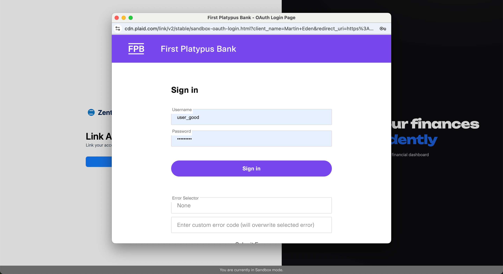

Enter **user_good / pass_good** and click **Sign in**.

### 5) Request MFA code
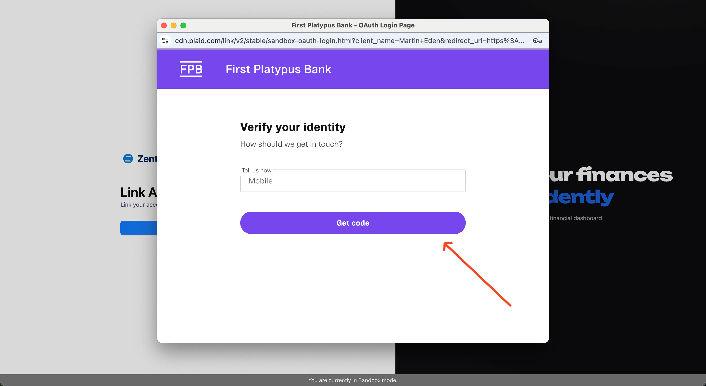

Click **Get code**. In Sandbox no real phone is needed.

### 6) Verify MFA
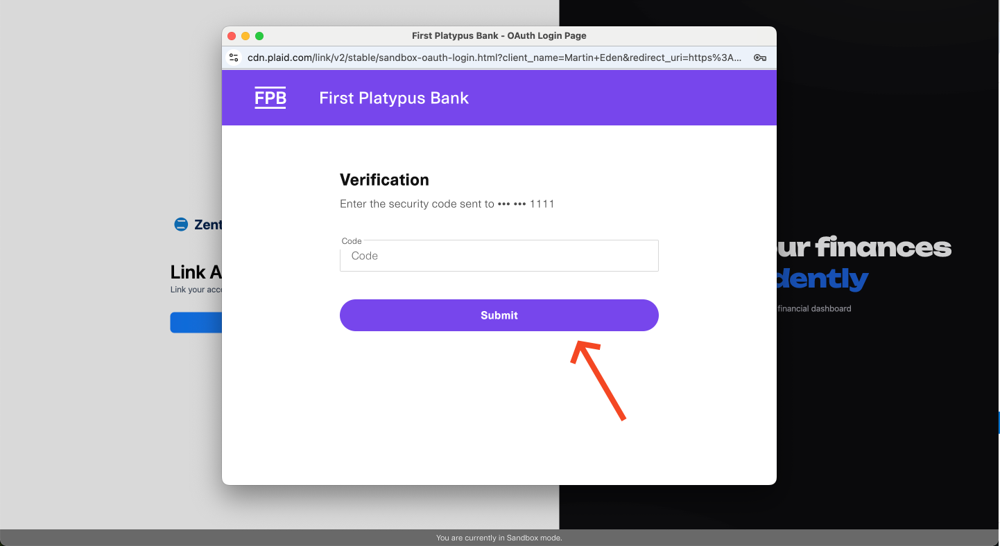

Just click **Submit**.

### 7) Select accounts to share
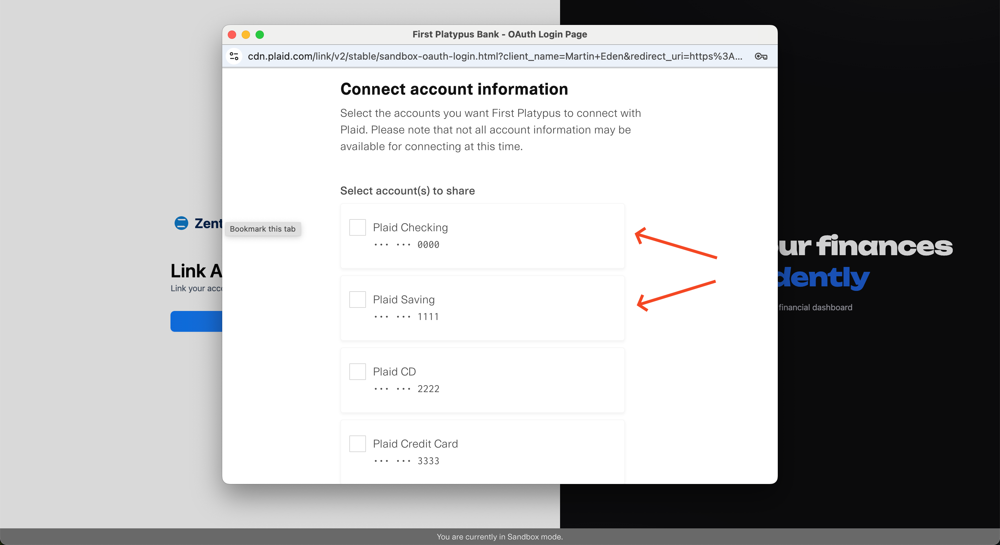

Choose one or more accounts (e.g., **Checking** and/or **Saving**).

### 8) Optional additional info
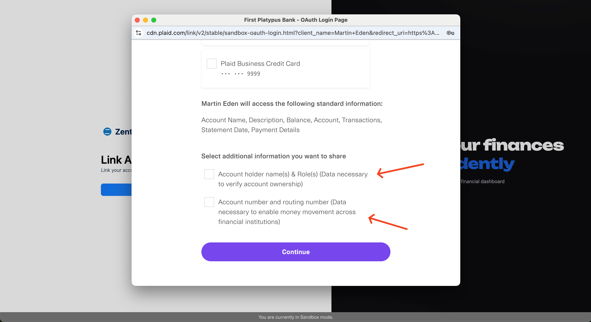

Choose that checkboxes and click continue.

### 9) Accept terms and connect
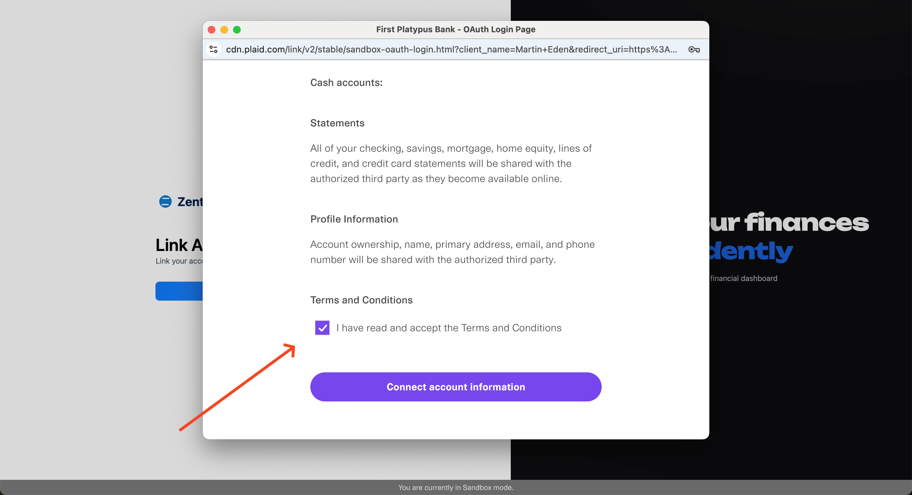

Check **I have read and accept the Terms and Conditions**, then click **Connect account information**.

### 10) Skip “Save with Plaid”
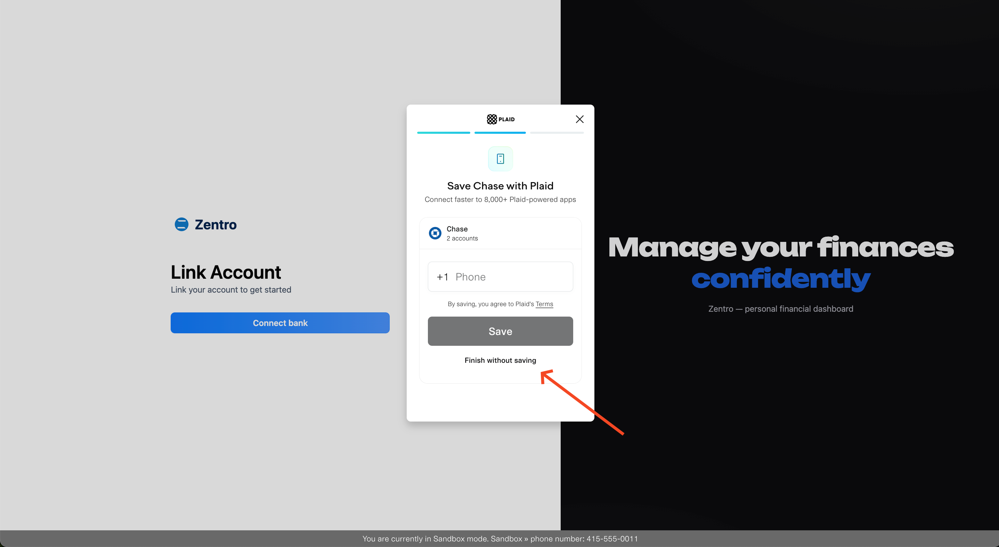

Click **Finish without saving** to skip phone saving.\
Loading can take a bit of time, please wait. You’ll be returned to Zentro and the newly linked bank will appear; balances and transactions will load on the dashboard.

### 11) You're in — Dashboard
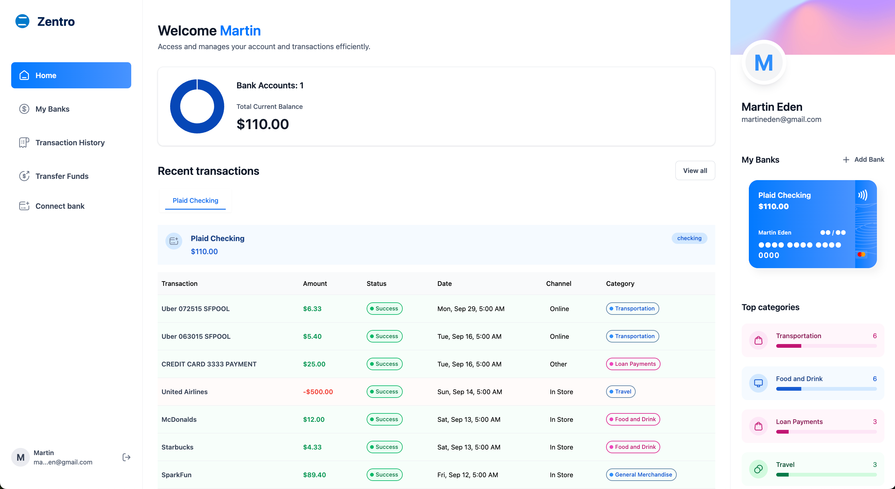

After linking, you land on **Home**.

Left navigation: 
- **My Banks**: see your bank cards and copy Plaid Sharable ID. 
- **Transaction History**: see your transaction history.
- **Transfer Funds**: transfer money between your accounts by ID.
- **Connect bank**: add another bank cards to your account.

---

## License

MIT (or your preferred license).
